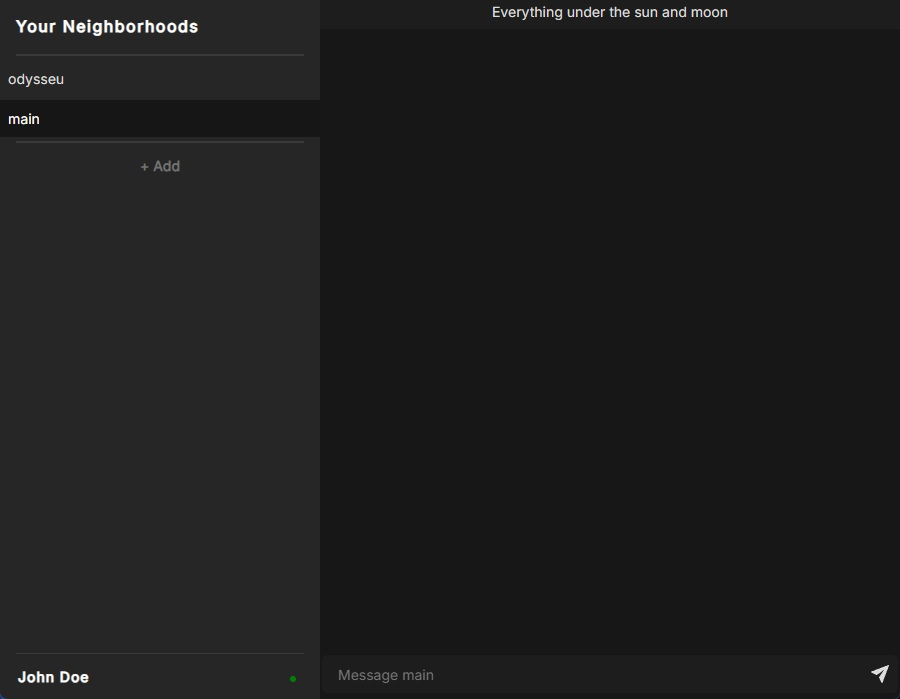
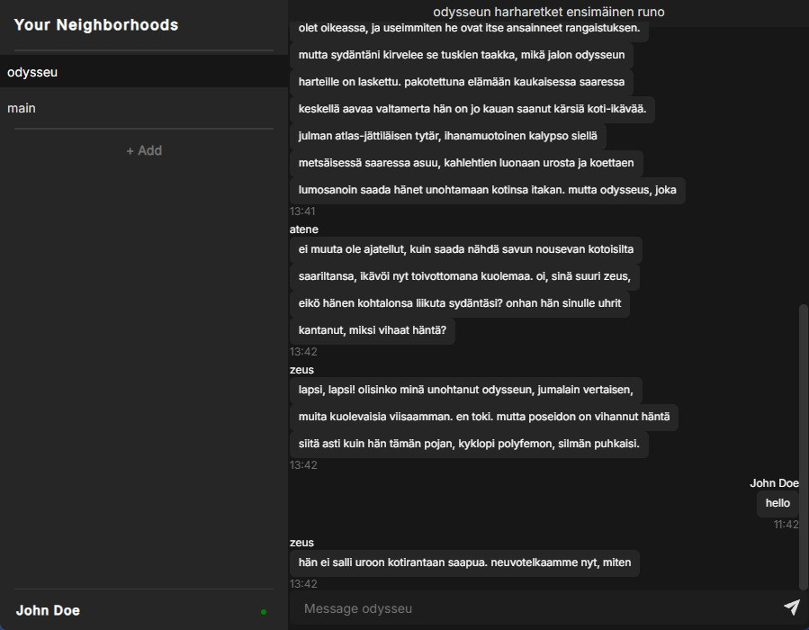

# Course project for Programming 4

A windows desktop front end for a chat server. Built with [dioxus](https://dioxuslabs.com/)
which uses WebView2 for rendering.

<div style="display: flex;width: 100%;">
  
  
</div>

## Prerequisites

- Maven and JDK 18 or later
- Rust
  - Binaries can be found [here](https://rust-lang.org/learn/get-started/)
- (optional) `cargo-binstall`. This allows installing built binaries, which makes setup quicker.
- `dioxus-cli`
  - `cargo install dioxus-cli` (or `cargo binstall dioxus-cli`)
  - Installation guide [here](https://dioxuslabs.com/learn/0.7/getting_started/)
    for possible problems
- `WebView2`. If Edge is installed on windows, this probably is already installed.

## Setting up dev server

This'll start up the [chat server](https://github.com/anttijuu/O4-server) on port `10000`:

```bash
git submodule update
cd server
mvn package
java -jar target/ChatServer-0.0.1-SNAPSHOT-jar-with-dependencies.jar chatserver.properties
```

## Full dev setup

```bash
cargo install cargo-binstall
cargo binstall dioxus-cli
```

### Running the application

Once setup is done, the application can be started in dev mode/demoed by running the following
command in the project's directory:

```bash
dx serve
```

> Note that `cargo run` will not work as the application doesn't have permissions to load assets from the assets folder.

## Common commands

| Task                    | Command               |
| ----------------------- | --------------------- |
| Running dev environment | `dx serve`            |
| Running linter          | `cargo clippy`        |
| Running dioxus linter   | `dx check`            |
| Bundling the project    | `dx bundle --desktop` |

## Misc Notes

- Multiple messages can be sent in a single message separated by newline `\n`?

## TODO

- Add dividers for message history view. Related files: `src/components/message_history.rs` and `src/components/routes/home.rs` They should display:
  - When date changes
  - When topic changes
- Use onkeydown for login input field as it would make writing experience more smooth. Related file: `src/components/input_field.rs`.
- Use an embedded font instead of fetching it from Google API. Not sure if its cached or fetced every time the app is opened? Related file: `src/main.rs`.
- Channels list in AppState (`src/main.rs`) could use a set implementation instead of Vec.
- Refresh button for channels as they're not always up to date.
  - If some implementation for updating channel information is created, showing channel user count would be possible.
